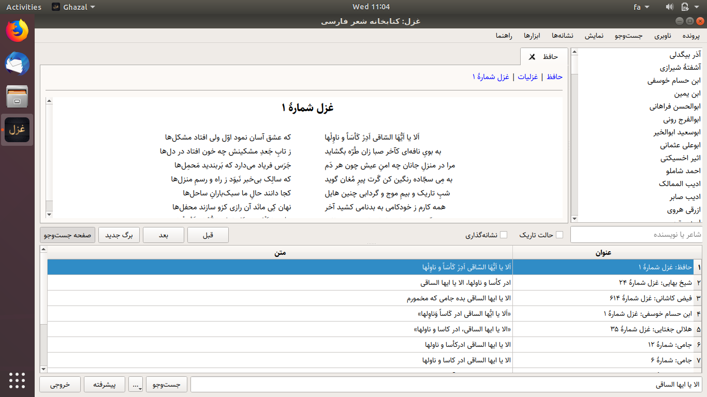
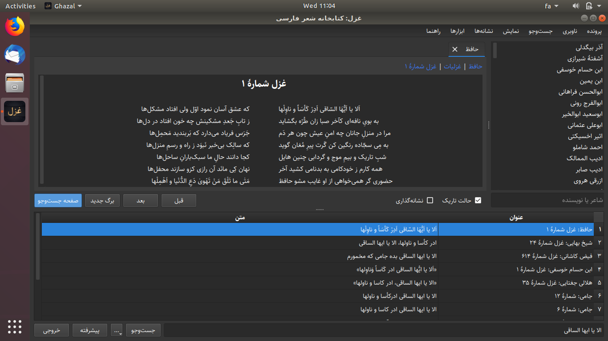
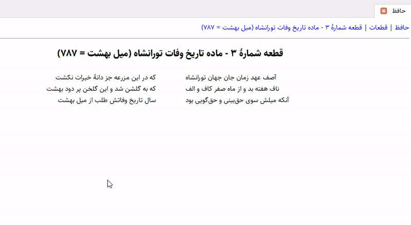

# Ghazal: The library of persian poetry
Ghazal is a library of persian poetry and a free and open-source software. Ghazal is written in C++ using the Qt framework. This software uses [Ganjoor](https://ganjoor.net) database. This branch here contains pre-built binaries for Linux, macOS and Windows.







## Software Requirements
- Qt 5 (The minimum version should be Qt 5.7) or Qt 6 (+core5compat)
- Supported compiler
  - Linux: The GNU Compiler Collection (GCC) 4.9.2 or later
  - macOS: Clang 4.0.0 or later
  - Windows: MinGW[64] compiler gcc 5.3 or later, or Microsoft Visual C++ (MSVC) compiler 2013 or later
- make
- zlib
- QuaZip
- [CMake]

## Building
Linux and macOS (cmake):
```
cd ghazal-src-dir
cmake . -Bbuild
cd build
make
```

Linux and macOS (qmake):
```
cd ghazal-src-dir
qmake ghazal.pro
make
```

Windows (cmake):
```
cd ghazal-src-dir
cmake . -Bbuild -G"MinGW Makefiles"
cd build
mingw32-make
```

Windows (qmake):
```
cd ghazal-src-dir
qmake ghazal.pro
mingw32-make
```

## PGP Public Key
Source and binary executables are signed with the following key:
- [abroshan39_PGP_public_key.asc](http://www.rosybit.com/abroshan39/abroshan39_PGP_public_key.asc) (Key ID: B0E5D23797D2D8CB)

You can import the public key from the MIT PGP Public Key Server by running a command like:
```
gpg --keyserver pgp.mit.edu --receive-keys B0E5D23797D2D8CB
```

## Authors
- Aboutaleb Roshan [@abroshan39](https://github.com/abroshan39)

## License
Ghazal is licensed under MIT. See the `LICENSE` file.
